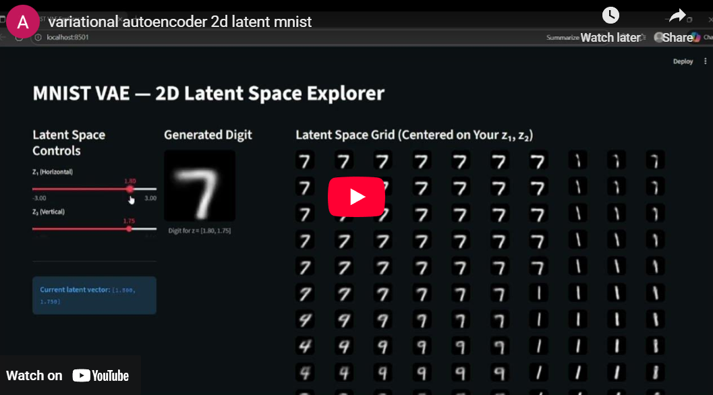
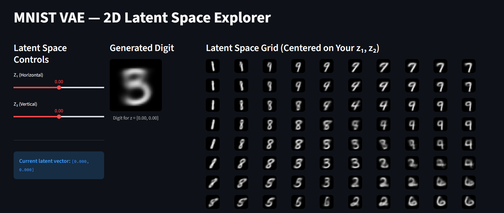
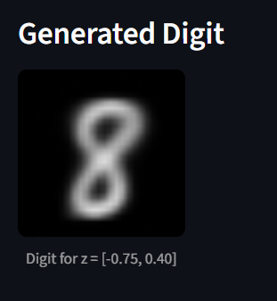
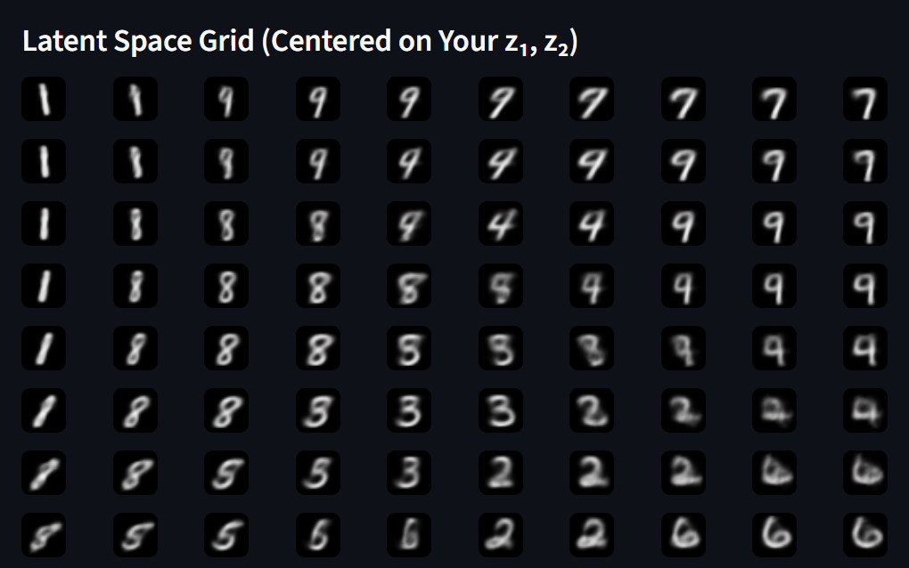
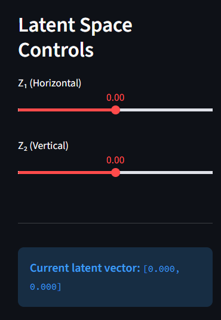

# Variational Autoencoder with 2D Latent Space 🧠✨

An interactive PyTorch implementation of a Variational Autoencoder (VAE) trained on MNIST digits with a 2-dimensional latent space. Explore the learned representations through an interactive web interface with real-time digit generation and latent space visualization.

[](https://www.youtube.com/embed/IR9TJbwHhXM?si=bgyeu6FJk8w35i0v)

## 📋 Description

This project implements a Variational Autoencoder with a constrained 2-dimensional latent space, making the learned representations easily visualizable and interpretable. By training on the MNIST dataset, the model learns to generate handwritten digits while maintaining a meaningful latent space that can be explored interactively.

The interactive Streamlit application allows users to navigate the 2D latent space using sliders, observe individual digit generation, and visualize a grid of generated digits centered at any point in the latent space.

<br>
<div align="center">
  <a href="https://variational-autoencoder-2d-latent-mnist.streamlit.app/">
    
  </a>
</div>
<br>
<div align="center">
  <a href="https://codeload.github.com/TendoPain18/variational-autoencoder-2d-latent-mnist/legacy.zip/main">
    
  </a>
</div>

## 🎯 Project Objectives

1. **Build a VAE Architecture**: Implement encoder and decoder networks
2. **2D Latent Space**: Constrain latent representation to 2 dimensions for visualization
3. **MNIST Training**: Train on handwritten digit dataset
4. **Interactive Exploration**: Create web interface for latent space navigation
5. **Digit Generation**: Real-time generation at arbitrary latent coordinates

## ✨ Features

### VAE Architecture
- **Encoder Network**: 784 → 400 → 200 → 2 (mean and log-variance)
- **Latent Space**: 2-dimensional with reparameterization trick
- **Decoder Network**: 2 → 200 → 400 → 784 (sigmoid output)
- **Loss Function**: Binary cross-entropy + KL divergence

### Interactive Interface
- **Dual Slider Controls**: Adjust Z₁ and Z₂ independently (-3 to +3 range)
- **Single Digit Generation**: Real-time digit synthesis at current latent position
- **Latent Space Grid**: 10×10 grid of generated digits centered on current point
- **Dynamic Grid**: Grid shifts as sliders move for continuous exploration

### Visualization
- **Control Panel**: Left column with Z₁ and Z₂ sliders
- **Generated Digit**: Center column with individual digit display
- **Latent Space Grid**: Right column with 10×10 exploration grid
- **Responsive Layout**: Wide layout for optimal display

## 🔬 Theoretical Background

### Variational Autoencoder (VAE)

**Architecture:**

The VAE consists of two main components:

1. **Encoder (Inference Network):**
```
q(z|x) = N(μ(x), σ²(x))
```
Maps input x to latent distribution parameters

2. **Decoder (Generative Network):**
```
p(x|z) = Bernoulli(decoder(z))
```
Reconstructs input from latent sample

**Reparameterization Trick:**
```
z = μ + σ ⊙ ε    where ε ~ N(0, 1)
```

Allows gradient flow through stochastic sampling.

### Loss Function

**ELBO (Evidence Lower Bound):**
```
L = E_q[log p(x|z)] - D_KL(q(z|x) || p(z))
  = Reconstruction Loss + KL Divergence
```

**Components:**

1. **Reconstruction Loss** (Binary Cross-Entropy):
```
BCE = -Σ [x·log(x̂) + (1-x)·log(1-x̂)]
```

2. **KL Divergence** (Regularization):
```
D_KL = 0.5 Σ [1 + log(σ²) - μ² - σ²]
```

### 2D Latent Space Interpretation

**Meaningful Representation:**
- Points in latent space correspond to different digit styles and orientations
- Interpolation between points smoothly transitions between digit variations
- Gaussian prior ensures efficient use of latent space

**Example Latent Traversal:**
```
Z₁ axis: Digit rotation/thickness variations
Z₂ axis: Digit type variations (similar digits)
Diagonal: Combined variations
```

## 📊 Model Architecture

### Encoder Architecture
```
Input (28×28 = 784)
    ↓
Linear(784 → 400) + LeakyReLU(0.5)
    ↓
Linear(400 → 200) + LeakyReLU(0.2)
    ↓
┌─────────────────────────────┐
│                             │
Linear(200 → 2)      Linear(200 → 2)
↓                            ↓
μ (mean)            log σ² (log-variance)
```

### Decoder Architecture
```
Latent Code (2)
    ↓
Linear(2 → 200) + LeakyReLU(0.2)
    ↓
Linear(200 → 400) + LeakyReLU(0.5)
    ↓
Linear(400 → 784) + Sigmoid
    ↓
Output (28×28 = 784)
```

### Hyperparameters

| Parameter | Value | Description |
|-----------|-------|-------------|
| Input Dim | 784 | 28×28 MNIST images flattened |
| Hidden Dim | 400 | First hidden layer size |
| Latent Dim | 2 | 2D latent space |
| Batch Size | 32 | Training batch size |
| Learning Rate | 1e-4 | Adam optimizer LR |
| Epochs | 100 | Training epochs |
| Beta (KL weight) | 1.0 | KL divergence weight |

## 🖥️ Interactive Interface



*Interactive Streamlit interface showing all three visualization panels*

### Interface Components

**Left Panel - Controls:**
- Z₁ Slider: Range -3.0 to +3.0, step 0.05
- Z₂ Slider: Range -3.0 to +3.0, step 0.05
- Current Latent Vector Display
- Real-time updates

**Center Panel - Generated Digit:**
- 28×28 pixel display
- Current latent position indicator
- High-quality MNIST-style output

**Right Panel - Latent Space Grid:**
- 10×10 grid of generated digits
- Centered on current (Z₁, Z₂) position
- Grid updates dynamically as sliders move
- Spacing: 1.5 units in both directions
- Shows local latent space structure

### Grid Generation Algorithm
```
grid_size = 10
span = 1.5

z1_grid = Z₁ + linspace(-span, span, grid_size)
z2_grid = Z₂ + linspace(span, -span, grid_size)

for i in range(grid_size):
    for j in range(grid_size):
        digit = model.decode([z1_grid[i], z2_grid[j]])
        display_at(column[i], row[j])
```

## 🎨 Generated Samples

### Single Digit Generation



*Example generated digit from random latent vector*

### Latent Space Exploration



*10×10 grid showing local latent space structure*

**Observations:**
- Neighboring digits are visually similar
- Smooth transitions across grid
- Clear digit variations along principal directions
- Well-organized latent space

### Control Bars



*Interactive slider controls for latent space navigation*

## 🚀 Getting Started

### Prerequisites

**Python Requirements:**
```
torch 2.0+
torchvision 0.15+
streamlit 1.28+
matplotlib 3.7+
numpy 1.24+
PIL 9.0+
```

**System Requirements:**
- CUDA 11.8+ (optional, for GPU acceleration)
- 4GB RAM minimum
- Modern web browser for Streamlit app

### Installation

1. **Clone the repository**
```bash
git clone https://github.com/yourusername/variational-autoencoder-2d-latent-space.git
cd variational-autoencoder-2d-latent-space
```

2. **Install dependencies**
```bash
pip install -r requirements.txt
```

3. **Download/Train Model**
```bash
# Option 1: Use pre-trained model
# (Download from releases)

# Option 2: Train from scratch
python train.py
```

4. **Run Streamlit App**
```bash
streamlit run app.py
```

The app will open at `http://localhost:8501`

## 📖 Usage Guide

### Training a Model

**From scratch:**
```bash
python train.py
```

Configuration options in `train.py`:
- Batch size: 32 (line 10)
- Learning rate: 1e-4 (line 11)
- Epochs: 100 (line 12)
- Latent dimension: 2 (line 18)

**Custom MNIST path:**
```python
train_loader, _ = get_mnist_loaders(
    batch_size=32,
    data_path='./data'  # Custom path
)
```

### Running the Interactive App

**Using Pre-trained Model:**
```bash
# Model must be in: trained_model/vae_mnist.pth
streamlit run app.py
```

**Using Custom Model:**
```python
# Edit app.py line 12-14
MODEL_PATH = "your_model_path/vae_mnist.pth"
model = VAE(latent_dim=2).to(DEVICE)
model.load_state_dict(torch.load(MODEL_PATH, map_location=DEVICE))
```

### Exploring the Latent Space

1. **Navigate using sliders:**
   - Move Z₁ slider to explore horizontal variations
   - Move Z₂ slider to explore vertical variations
   - Observe digit generation updates in real-time

2. **Watch the grid shift:**
   - Grid stays centered on current point
   - Neighboring digits show smooth transitions
   - Extremes show digit diversity

3. **Identify patterns:**
   - Similar digits cluster together
   - Rotation/thickness variations along axes
   - Interpolation between digit types

## 🔧 Technical Details

### Key Components

**VAE Class** (`my_models/vae.py`):
- Encoder: Maps MNIST image to latent parameters
- Reparameterize: Implements sampling trick
- Decode: Generates image from latent vector
- Forward: Complete forward pass

**Loss Function** (`utils/loss.py`):
```python
def vae_loss(recon_x, x, mu, logvar):
    BCE = F.binary_cross_entropy(recon_x, x, reduction='sum')
    KLD = -0.5 * torch.sum(1 + logvar - mu.pow(2) - logvar.exp())
    return BCE + KLD
```

**Streamlit App** (`app.py`):
- Model loading and caching
- Interactive slider controls
- Real-time grid generation
- Responsive visualization

## 🎓 Learning Outcomes

This project demonstrates:

1. **Generative Models**: Understanding VAE architecture and training
2. **Latent Representations**: Learning meaningful low-dimensional embeddings
3. **Probability Theory**: Reparameterization trick, KL divergence
4. **PyTorch**: Neural network implementation and training
5. **Web Interfaces**: Building interactive apps with Streamlit
6. **Visualization**: Effective display of high-dimensional data
7. **2D Visualization**: Exploring latent spaces in 2D

## 🔄 Future Improvements

- Extend to higher-dimensional latent spaces
- Implement β-VAE for interpretability
- Add semi-supervised learning
- Support for other datasets (CIFAR-10, CelebA)
- Adversarial VAE (AAE) variant
- Attention mechanisms in decoder
- Multi-scale architecture

## 🤝 Contributing

Contributions are welcome! Feel free to:

- Suggest architectural improvements
- Add new features to Streamlit app
- Improve training efficiency
- Add more visualization options
- Optimize model performance

## 📄 License

This project is licensed under the MIT License - see the [LICENSE](LICENSE) file for details.

## 🙏 Acknowledgments

- MNIST dataset from Yann LeCun
- PyTorch framework and community
- Streamlit for web app framework
- VAE foundational papers (Kingma & Welling, 2013)

<br>
<div align="center">
  <a href="https://codeload.github.com/TendoPain18/variational-autoencoder-2d-latent-mnist/legacy.zip/main">
    
  </a>
</div>

## **Explore the beautiful world of generative models! 🧠✨**
